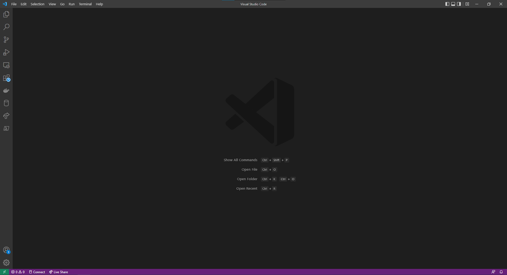
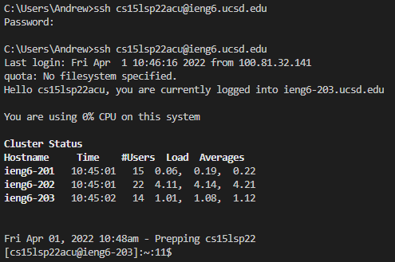
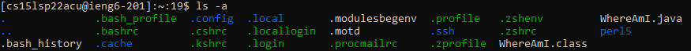
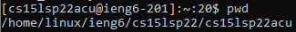
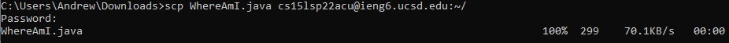
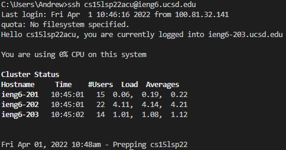
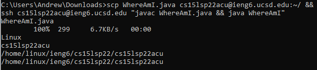

# CSE 15L Week 2 Lab Report

## Installing VSCode
The VSCode installation is fairly straightforward.
First download the installer from [Microsoft's Website](https://code.visualstudio.com/).
Then use the default settings and install it.
It should then open as seen below:  

## Remotely Connecting
Next we will use ssh to connect to the ieng6 server.
First get your account information from [ITS](https://sdacs.ucsd.edu/~icc/index.php).
Then run the command `ssh cs15lsp22xxx@ieng6.ucsd.edu` where
`xxx` represents the unique 3 letter combination that was
retreived from ITS. Enter your password when prompted
and you should successfully reach the main screen
as seen below:  

## Trying Some Commands
Now that we are logged into the remote system, 
we can run some commands on it. I opted to try
the ls -a command which lists all files including
hidden files:  

I also tried the pwd command which prints your
current working directory:  

## Moving Files with SCP
Now we want to get local files onto the remote
server by using the SCP command. We can do this
by calling `scp source/path/to/file username@destination.server.address:/path/to/destination`.
In the case below, we called the command in the folder
with the file so just the filename was needed, and
the server address was `ieng6.ucsd.edu` with the
destination path being the home directory:
  
Now the file should've been copied to the remote system.

## Setting an SSH Key
To setup an SSH key, first use key-gen to generate
an ssh key (preferably an ed25519 standard key).
Detailed instructions can be found in Microsoft's
documentation [here](https://docs.microsoft.com/en-us/windows-server/administration/openssh/openssh_keymanagement#user-key-generation)
Once the key is added, you need to add it to the remote
system by using SCP to copy the contents of the
public key to ~/.ssh/authorized_keys. Now it should
log into the server without requiring a password as seen
below:  

## Optimizing Remote Running
To optimize running code remotely, we avoid using
ssh in interactive mode and instead pass commands
to it as an argument. We also chain several commands
together to avoid human delay. Thus we can chain together
scp, the compilation, and run step to achieve the 
sub-4 second runtime that was required to copy, compile,
and run WhereAmI with the command
shown below:  

